# Enterprise Salon Booking System
## Operations & Architecture Blueprint

*A unified reference for how the business runs and how the platform is built to run it.*

This document has four parts. Part 1 is the operational rulebook — the business logic any booking engine has to encode correctly. Part 2 is the technical architecture that encodes it. Part 3 is the engineering checklist for building it right. Part 4 covers scaling and operations.

> **Diagram note:** all diagrams below use [Mermaid](https://mermaid.js.org/) syntax and render natively on GitHub, GitLab, Obsidian, and VS Code (with the Mermaid extension installed).

---

## Contents

- **Part 1 — How the Salon Operates**
  - 1.1 Executive Summary
  - 1.2 The Service Catalog
  - 1.3 Workforce Management
  - 1.4 Booking Engine Mechanics
  - 1.5 Walk-Ins & the Waitlist
  - 1.6 Inventory: Retail vs. Backbar
  - 1.7 Payments, POS & Revenue Protection
  - 1.8 Operational Reporting & KPIs
- **Part 2 — Technical Architecture**
  - 2.1 Architecture Principles
  - 2.2 Stakeholder Perspectives
  - 2.3 Tech Stack
  - 2.4 High-Level System Architecture
  - 2.5 Layered Request Flow
  - 2.6 Authentication Flow (JWT)
  - 2.7 Concurrency Control (Distributed Locking)
  - 2.8 Appointment Lifecycle
  - 2.9 Data Model
  - 2.10 Proposed Project Structure
  - 2.11 API Surface
- **Part 3 — Engineering Standards: What To Do**
  - 3.1 Must-Do
  - 3.2 Must-Not-Do
  - 3.3 Validation Pattern
  - 3.4 Error Handling Pattern
  - 3.5 Distributed Lock Helper
- **Part 4 — Non-Functional Requirements & Scaling**
  - 4.1 Statelessness & Horizontal Scaling
  - 4.2 Graceful Shutdown
  - 4.3 Observability
  - 4.4 Environment Configuration

---

## Part 1 — How the Salon Operates

### 1.1 Executive Summary

A salon is a time-bound logistics operation before it's a retail one. Where a normal store's inventory is physical stock on a shelf, a salon's core inventory is **employee time** — a finite number of chair-hours per day that either get sold or evaporate. Every rule in this document, from tiered pricing to the waitlist, exists to protect and maximize the utilization of that time inventory, while the salon simultaneously manages two secondary inventories: **backbar** (chemicals consumed during a service) and **retail** (products sold off the shelf).

### 1.2 The Service Catalog

The service catalog isn't a static price list — it's a matrix of time, skill, and resource requirements that the scheduling engine reads before it will place anything on a calendar.

**Categorization & tiered pricing**

- **Gender-specific routing.** A "Ladies Balayage" and a "Gents Color Camo" imply different processing times and chemical volumes, so the client-facing catalog filters by the client's profile.
- **Tiered pricing.** The same catalog item has a different price depending on who performs it:

| Employee Tier | Example: "Signature Haircut" |
|---|---|
| Junior Stylist | $40 |
| Senior Stylist | $75 |
| Master Director | $120 |

**Anatomy of a service time-block**

A booked appointment is never a single block — it's three phases the engine has to calculate separately:

1. **Application time** — active, hands-on work (e.g. applying color for 45 minutes).
2. **Processing time** — passive time while a chemical sets (e.g. 30 minutes under a dryer).
3. **Buffer / turnaround time** — sanitizing the station between clients (typically 10–15 minutes).

The important architectural consequence: during *processing* time, the stylist isn't actually busy. An advanced engine shows that window as bookable, so a second, shorter service can be layered in underneath the first:

```mermaid
gantt
    title Stylist Timeline: Double-Booking During Processing Time
    dateFormat HH:mm
    axisFormat %H:%M

    section Client A — Color Service
    Application (dye applied)    :a1, 09:00, 45m
    Processing (under dryer)     :a2, after a1, 30m
    Finishing touches            :a3, after a2, 15m

    section Client B — fills the gap
    Men's Haircut                :b1, 09:45, 30m

    section Workstation
    Buffer / sanitize            :c1, after a3, 15m
```

### 1.3 Workforce Management

Staff don't work static 9-to-5 shifts, and the calendar engine has to reconcile several independent layers of constraint before it can call a stylist "available."

| Constraint | Description | Booking Engine Behavior |
|---|---|---|
| Standard Shifts | Recurring weekly schedule (e.g. Tue–Sat) | Forms the base availability matrix |
| Breaks | Statutory unpaid lunch blocks | Hard block — no service can overlap |
| Leave / PTO | Approved vacation or sick days | Overrides standard shifts; triggers waitlist for affected bookings |
| Specializations | Named skills (e.g. "Curly Hair Expert") | Filters "First Available" search results |

**Commission & payroll**

Salons rarely pay a flat hourly wage. Three separate calculations run on every ticket:

- **Service commission** — a percentage of the labor charge (e.g. 40% to the stylist, 60% to the house).
- **Retail commission** — a smaller percentage on any product the stylist sells (e.g. 10% on a $30 shampoo → $3).
- **Backbar fee deduction** — many salons subtract a flat "product cost" fee (e.g. $5) from the stylist's gross *before* splitting, to recover the cost of the chemicals used.

Worked example — a $120 color service at a 40/60 split with a $5 backbar fee:

| Step | Amount |
|---|---|
| Gross service price | $120.00 |
| − Backbar fee | −$5.00 |
| Adjusted gross for split | $115.00 |
| Stylist share (40%) | $46.00 |
| House share (60% + backbar fee) | $74.00 |

### 1.4 Booking Engine Mechanics

When a client searches for a booking, the engine handles one of two distinct intents:

- **Specific provider.** The client picks "Sarah" by name — the query only evaluates Sarah's shifts and existing bookings.
- **First available.** The client picks "Haircut" + "Friday" — the engine has to match the service's requirements against every employee's specializations, filter to who's on shift, and aggregate the result into one list of open slots.

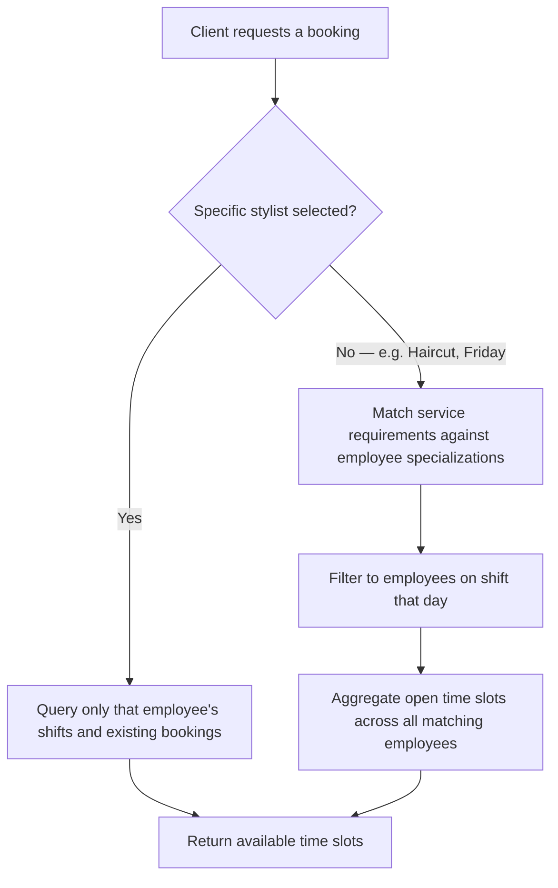

**Bridal & event bookings**

A bridal party of four needs four stylists locked at once — a rule standard single-resource booking can't express. The backend opens a distributed lock across all four schedules simultaneously; if even one stylist gets grabbed by a walk-in mid-transaction, the whole booking rolls back rather than confirming a partial party. Off-site events (e.g. a hotel) also get automatic travel-time blocks appended before and after the service block.

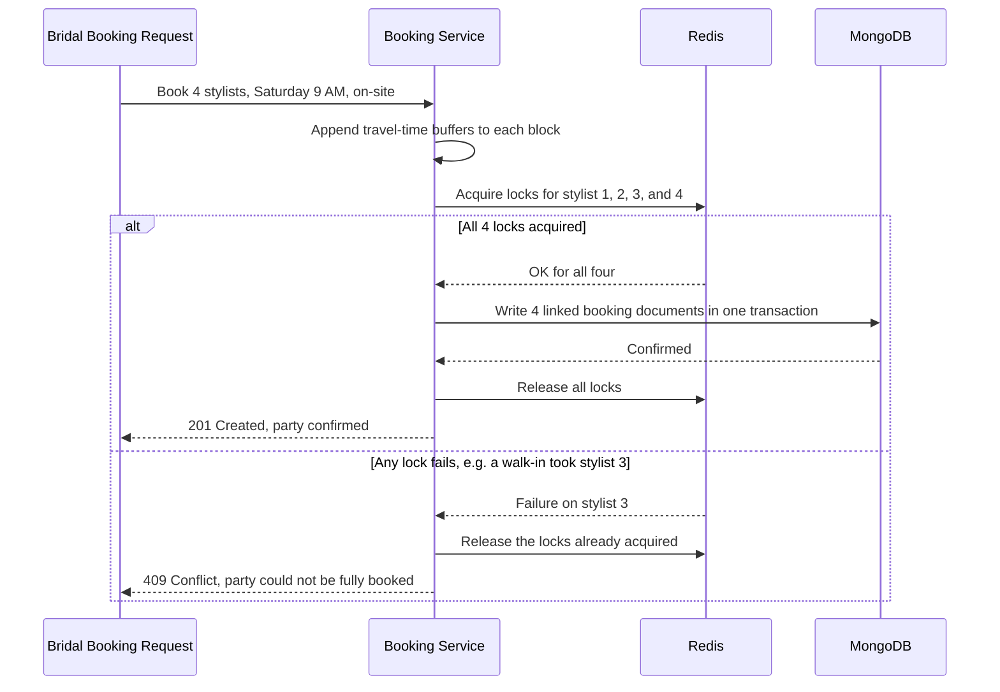

### 1.5 Walk-Ins & the Waitlist

Walk-ins and pre-booked appointments share the same floor in real time.

**Walk-in routing.** If a stylist has an open gap — a no-show or a fast finish — the receptionist converts the walk-in straight into a booking.

**The digital waitlist.** When the floor is full, the client joins the waitlist, which does two things a plain FIFO queue can't:

- **Estimates wait time** from the active bookings currently on the floor and their projected completion times.
- **Escalates by fit, not just arrival order.** If a 20-minute gap opens and someone's been waiting for a 3-hour color, that gap goes to the person waiting for a 15-minute beard trim instead — first-in-line doesn't mean first-served if the service doesn't fit.

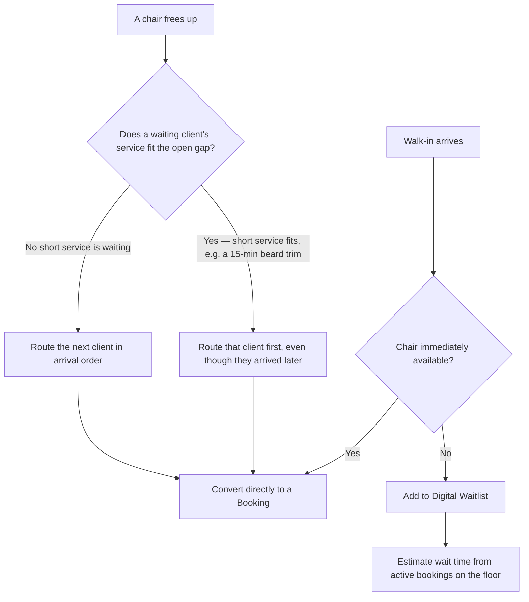

### 1.6 Inventory: Retail vs. Backbar

Inventory splits into two flows that share almost nothing operationally.

| | Retail | Backbar |
|---|---|---|
| What it is | Shampoos, styling creams, tools on the shelf | Bulk chemicals, color, wash-station product |
| Sold to client? | Yes, directly | No — consumed during the service |
| Mechanics | Standard e-commerce: POS sale decrements stock | Deducted automatically based on a standard-use formula per service |
| Commission | Stylist earns retail commission on the sale | None directly — but overages generate an upcharge |
| Alerts | Low-stock threshold triggers purchase orders | Same idea, tracked against consumption rate rather than sales |

**Overages.** Standard use is a formula — a root touch-up theoretically consumes 40g of color, decremented automatically on completion. A client with unusually thick hair might need 80g; the stylist logs the extra 40g on their iPad, and the system automatically adds a "Product Overage Charge" (e.g. $15) to the ticket so the extra cost doesn't erode the salon's margin.

### 1.7 Payments, POS & Revenue Protection

No-shows are the single largest threat to salon profitability, so the system protects revenue at two points:

- **Advance deposits.** High-ticket services (e.g. keratin treatments) require a 20% deposit through a payment gateway (Stripe) before the slot lock is confirmed.
- **Card on file.** Standard bookings vault a credit card; a cron job scans for no-shows past their start time and automatically charges a cancellation penalty (e.g. 50%).

**Checkout calculation** — a single transaction aggregates several data streams:

| Line Item | Source | Impact |
|---|---|---|
| Base Service | Service Catalog | Adds to gross revenue; triggers service commission |
| Product Upcharge | Backbar overage input | Adds to gross revenue; offsets inventory cost |
| Retail Items | Shelf scan | Decrements retail stock; triggers retail commission |
| Advance Deposit | Prior transaction | Deducted from total due |
| Gratuity / Tip | Client input | Passed 100% to the employee; not taxed as salon revenue |

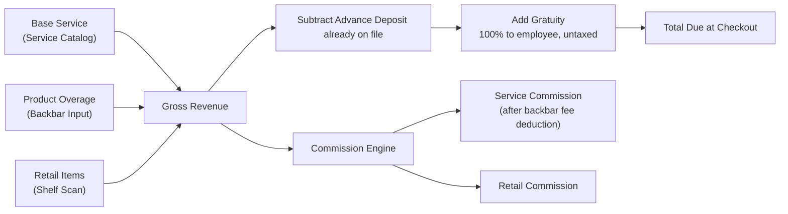

### 1.8 Operational Reporting & KPIs

| KPI | Definition | Why it matters |
|---|---|---|
| Chair Utilization Rate | Revenue-generating service hours ÷ total available shift hours | How efficiently paid staff time converts into billable time |
| Pre-book Percentage | Clients who book their next visit before leaving today ÷ total clients today | The leading indicator of salon health |
| Average Ticket Size | Total revenue ÷ total clients | Signals upsell and retail attach-rate success |
| Client Retention Rate | First-time clients who return within 90 days ÷ total first-time clients | Measures long-term relationship health |

---

## Part 2 — Technical Architecture

This is a high-availability, enterprise-grade booking engine built to survive concurrent transactions, enforce role-based access, and scale across web, iOS, and Android from a single API.

### 2.1 Architecture Principles

- **Stateless by design.** No server-side session or cookie state — every request carries its own identity via a signed JWT in the `Authorization: Bearer <token>` header. This is what makes the same API usable by the web dashboard, iOS, Android, and future kiosk/POS clients without special-casing any of them.
- **Layered / domain-driven boundaries.** `Routes → Controllers → Services → Repositories`. Business rules — scheduling math, commission splits, lock acquisition — live only in the Service layer, never in a controller or a raw database query.
- **Concurrency safety first.** A database uniqueness constraint alone can't close the gap between "check availability" and "write the booking." Redis distributed locks wrap that critical section so only one request ever wins a given time slot.
- **Fail loud internally, fail safe externally.** Full stack traces go to the server log; the client only ever sees a sanitized, consistently shaped error object.

### 2.2 Stakeholder Perspectives

> **Tech Lead:** Concurrency is the central risk — two people trying to book the same stylist at the same millisecond. Redis distributed locks close that race-condition window, and the layered structure keeps scheduling and payment rules isolated from HTTP and persistence code.
>
> **Backend Developer:** TypeScript interfaces (`IBooking`, `IUser`) are the contract. Validate everything at the route edge, keep controllers thin, and never trust identity fields from `req.body` — always decode them from the JWT.
>
> **Project Manager:** The upfront cost of wiring up Redis, TypeScript, and error middleware is small next to the cost of a production double-booking bug. The layered boundaries also let two developers build payments and scheduling in parallel without stepping on each other.
>
> **Business Owner:** A deposit that locks a 2:00 PM slot actually locks it. And because the services are stateless, the same backend that handles one location handles fifty without a redesign.

### 2.3 Tech Stack

| Layer | Technology | Purpose |
|---|---|---|
| Runtime | Node.js | Non-blocking I/O event loop |
| Framework | Express.js | HTTP routing and middleware pipeline |
| Language | TypeScript | Compile-time type safety; shared contracts (`IBooking`, `IUser`) |
| Database | MongoDB (Mongoose) | Flexible schema for evolving service/staff relationships |
| Locking / Cache | Redis | Distributed locks, first-available search caching |
| Auth | JWT (Bearer header) | Stateless, mobile- and cross-origin-friendly |
| Validation | Zod / Joi | Route-level payload validation |
| Payments | Stripe | Deposit capture, card-on-file, no-show penalty charge |
| Scheduling | node-cron / BullMQ | No-show penalty jobs, waitlist reminders |

### 2.4 High-Level System Architecture

The API is a single stateless service — any instance can answer any request, since nothing but the JWT identifies the caller.

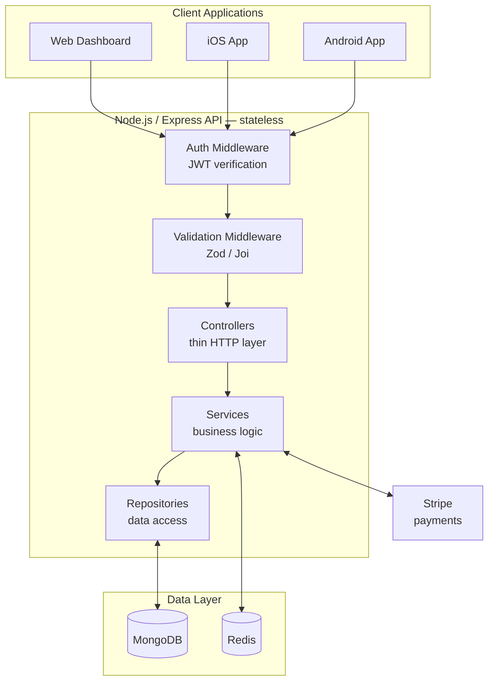

### 2.5 Layered Request Flow

Every request moves through the same four layers in the same order, whether it's a booking, a shift update, or a checkout. Controllers stay "thin" on purpose — they only translate HTTP in and HTTP out.

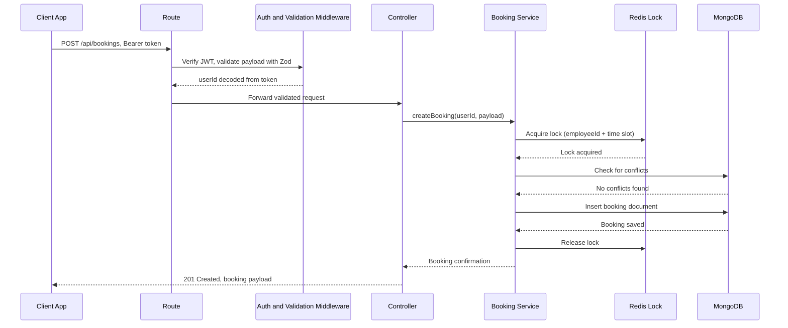

### 2.6 Authentication Flow (JWT)

Cookies are fine for a single web app, but an enterprise system has to anticipate native mobile clients and cross-origin API consumers, both of which cookies handle badly. Moving identity into a signed bearer token removes CSRF exposure entirely (there's no cookie to forge) and makes every client — web, iOS, Android — talk to the API the same way.

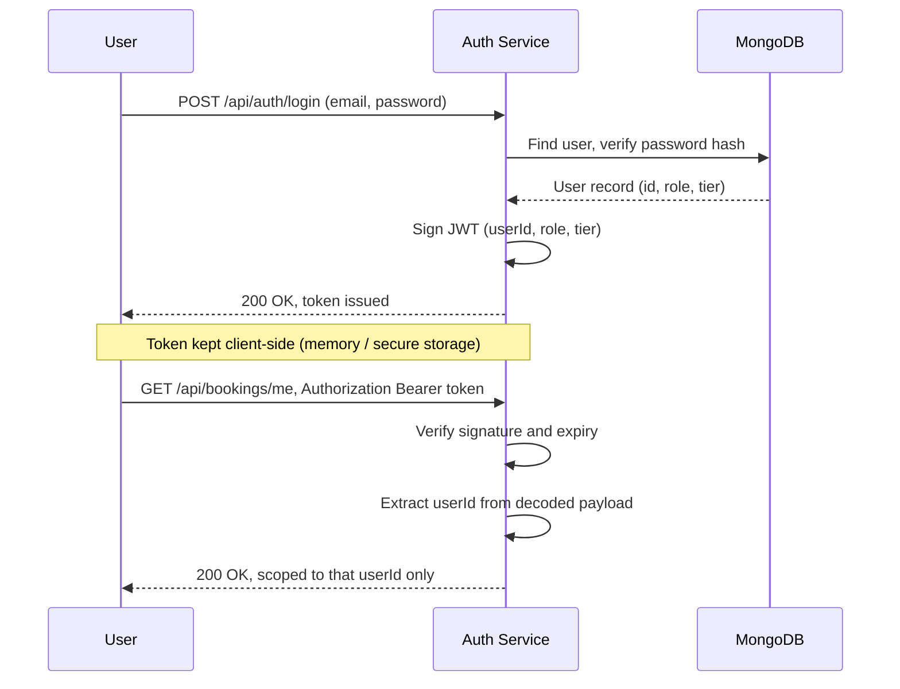

### 2.7 Concurrency Control (Distributed Locking)

The single biggest risk in a booking system is two clients confirming the same slot. A database check-then-write alone leaves a gap between "read availability" and "write booking" that two simultaneous requests can both slip through. Redis closes that gap with an atomic `SET ... NX` lock: whoever acquires the key wins, and the loser gets a clean `409` instead of a corrupted calendar.

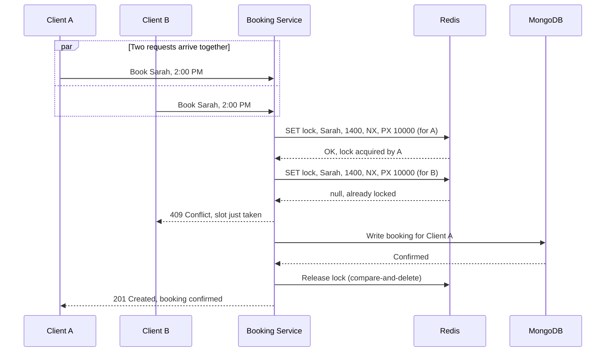

### 2.8 Appointment Lifecycle

The state machine below is where the domain rules from Part 1 meet the system: `Processing` is the same window shown in the Gantt chart in 1.2, and `NoShow` is what the revenue-protection cron job in 1.7 acts on.

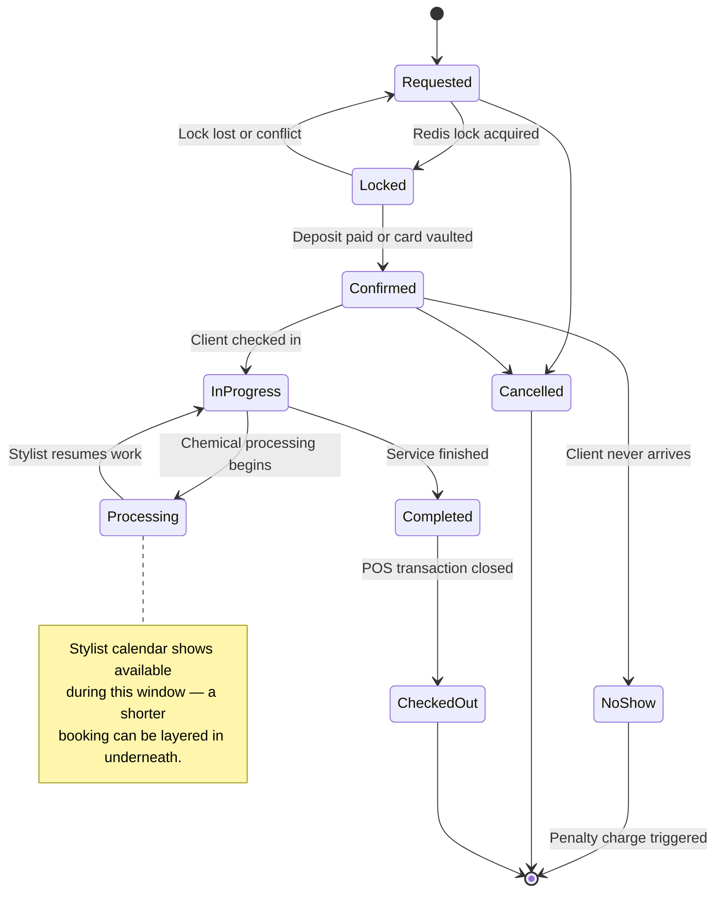

### 2.9 Data Model

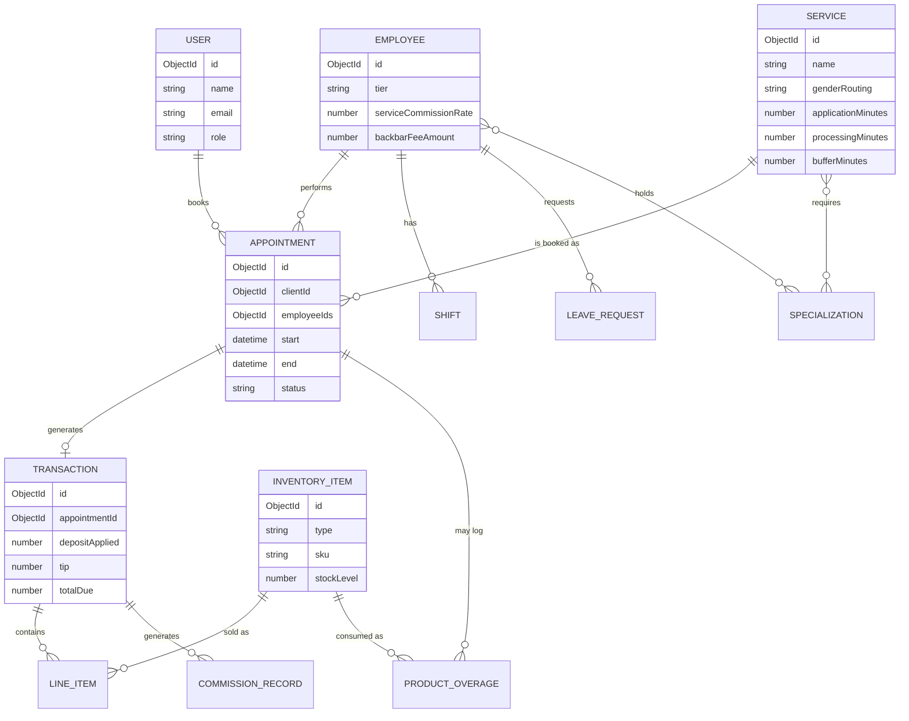

### 2.10 Proposed Project Structure

```text
src/
├── config/
│   ├── env.ts
│   ├── db.ts
│   └── redis.ts
├── routes/
│   ├── auth.routes.ts
│   ├── booking.routes.ts
│   ├── employee.routes.ts
│   ├── service.routes.ts
│   ├── inventory.routes.ts
│   ├── waitlist.routes.ts
│   └── payment.routes.ts
├── controllers/
│   ├── auth.controller.ts
│   ├── booking.controller.ts
│   └── ...
├── services/
│   ├── auth.service.ts
│   ├── booking.service.ts
│   ├── lock.service.ts          # Redis distributed lock wrapper
│   ├── commission.service.ts
│   ├── inventory.service.ts
│   ├── waitlist.service.ts
│   └── payment.service.ts
├── repositories/
│   ├── booking.repository.ts
│   ├── employee.repository.ts
│   └── ...
├── models/                       # Mongoose schemas
│   ├── User.model.ts
│   ├── Employee.model.ts
│   ├── Service.model.ts
│   ├── Appointment.model.ts
│   ├── Transaction.model.ts
│   └── InventoryItem.model.ts
├── middleware/
│   ├── auth.middleware.ts        # JWT verification
│   ├── validate.middleware.ts    # Zod schema validation
│   └── errorHandler.middleware.ts
├── validators/                   # Zod schemas
│   ├── booking.schema.ts
│   └── ...
├── jobs/                         # Cron / scheduled tasks
│   ├── noShowPenalty.job.ts
│   └── waitlistReminder.job.ts
├── types/
│   ├── IBooking.ts
│   ├── IUser.ts
│   └── ...
├── utils/
│   ├── logger.ts
│   └── errors.ts
├── app.ts                        # Express app assembly
└── server.ts                     # Entry point + graceful shutdown
```

### 2.11 API Surface

**Auth**

| Method | Path | Description | Auth |
|---|---|---|---|
| POST | `/api/auth/register` | Create a client or staff account | Public |
| POST | `/api/auth/login` | Exchange credentials for a JWT | Public |
| POST | `/api/auth/refresh` | Rotate an access token | Refresh token |

**Service Catalog**

| Method | Path | Description | Auth |
|---|---|---|---|
| GET | `/api/services` | List services, filterable by gender routing | Public |
| GET | `/api/services/:id` | Get one service with its time-block breakdown | Public |
| POST | `/api/services` | Create a service | Admin |
| PATCH | `/api/services/:id` | Update pricing tiers or durations | Admin |

**Employees & Scheduling**

| Method | Path | Description | Auth |
|---|---|---|---|
| GET | `/api/employees` | List staff, filterable by specialization | Public |
| GET | `/api/employees/:id/availability` | Open slots for a given date | Public |
| POST | `/api/employees/:id/shifts` | Set a recurring weekly shift | Admin |
| POST | `/api/employees/:id/leave` | Submit or approve PTO | Staff / Admin |

**Bookings**

| Method | Path | Description | Auth |
|---|---|---|---|
| GET | `/api/bookings/first-available` | Aggregated open slots across matching staff | Public |
| POST | `/api/bookings` | Create a booking (acquires a Redis lock) | Client |
| POST | `/api/bookings/bridal` | Multi-stylist event booking (multi-lock) | Client |
| POST | `/api/bookings/:id/checkin` | Mark a client as arrived | Front desk |
| PATCH | `/api/bookings/:id/cancel` | Cancel a booking | Client / Front desk |

**Waitlist**

| Method | Path | Description | Auth |
|---|---|---|---|
| POST | `/api/waitlist` | Add a walk-in to the queue | Front desk |
| GET | `/api/waitlist/estimate` | Estimated wait time | Public |
| DELETE | `/api/waitlist/:id` | Remove from queue (seated or left) | Front desk |

**Inventory**

| Method | Path | Description | Auth |
|---|---|---|---|
| GET | `/api/inventory/backbar` | Current backbar stock levels | Staff |
| GET | `/api/inventory/retail` | Current retail stock levels | Staff |
| POST | `/api/inventory/overage` | Log extra product used on a ticket | Staff |
| POST | `/api/inventory/retail/sale` | Record a retail sale | Front desk |

**Payments & POS**

| Method | Path | Description | Auth |
|---|---|---|---|
| POST | `/api/payments/deposit` | Capture a booking deposit | Client |
| POST | `/api/checkout/:appointmentId` | Run the full checkout calculation | Front desk |
| POST | `/api/payments/no-show-charge` | Internal — triggered by the no-show cron job | System |

**Reporting**

| Method | Path | Description | Auth |
|---|---|---|---|
| GET | `/api/reports/chair-utilization` | Utilization rate by employee / date range | Admin |
| GET | `/api/reports/prebook-rate` | Pre-book percentage | Admin |
| GET | `/api/reports/average-ticket` | Average ticket size | Admin |
| GET | `/api/reports/retention` | 90-day client retention rate | Admin |

---

## Part 3 — Engineering Standards: What To Do

### 3.1 Must-Do

1. Validate all incoming payloads at the route level (Zod or Joi) before they ever reach a controller.
2. Keep controllers thin — extract the request, delegate to a service, return the response.
3. Extract `userId` and `role` from the decoded JWT, never from `req.body`.
4. Require a Redis lock before checking availability and writing a new booking.
5. Implement graceful shutdown — cleanly close MongoDB and Redis connections on `SIGTERM` or crash.
6. Inject all secrets (JWT signing key, DB URI, Redis URL, Stripe key) via environment variables.
7. Log the full stack trace internally; return a sanitized, consistent error shape to the client.

### 3.2 Must-Not-Do

1. Don't leak persistence logic (Mongoose calls) into controllers — keep it in repositories and services.
2. Don't trust client-supplied identity fields.
3. Don't block the event loop with synchronous, CPU-heavy work (bulk exports, sync hashing) — offload it to a background job.
4. Don't hardcode secrets or config values in source code.
5. Don't swallow errors in a generic `try/catch` that fails silently.

### 3.3 Validation Pattern

```typescript
// validators/booking.schema.ts
import { z } from "zod";

export const createBookingSchema = z.object({
  serviceId: z.string().min(1),
  employeeId: z.string().optional(), // omitted = "first available" search
  startTime: z.string().datetime(),
});

export type CreateBookingInput = z.infer<typeof createBookingSchema>;
```

```typescript
// middleware/validate.middleware.ts
import { Request, Response, NextFunction } from "express";
import { ZodSchema } from "zod";

export const validate = (schema: ZodSchema) =>
  (req: Request, res: Response, next: NextFunction) => {
    const result = schema.safeParse(req.body);
    if (!result.success) {
      return res.status(400).json({
        success: false,
        error: { code: "VALIDATION_ERROR", details: result.error.flatten() },
      });
    }
    req.body = result.data;
    next();
  };
```

### 3.4 Error Handling Pattern

```typescript
// middleware/errorHandler.middleware.ts
import { Request, Response, NextFunction } from "express";
import { AppError } from "../utils/errors";
import { logger } from "../utils/logger";

export function errorHandler(
  err: AppError,
  req: Request,
  res: Response,
  next: NextFunction
) {
  logger.error({ message: err.message, stack: err.stack, path: req.path });

  res.status(err.statusCode ?? 500).json({
    success: false,
    error: {
      code: err.code ?? "INTERNAL_ERROR",
      message: err.isOperational ? err.message : "Something went wrong.",
    },
  });
}
```

### 3.5 Distributed Lock Helper

```typescript
// services/lock.service.ts
import { randomUUID } from "crypto";
import { redis } from "../config/redis";
import { ConflictError } from "../utils/errors";

const RELEASE_IF_OWNER = `
  if redis.call("get", KEYS[1]) == ARGV[1] then
    return redis.call("del", KEYS[1])
  end
  return 0
`;

export async function withLock<T>(
  key: string,
  ttlMs: number,
  fn: () => Promise<T>
): Promise<T> {
  const token = randomUUID();
  const acquired = await redis.set(key, token, "PX", ttlMs, "NX");
  if (!acquired) {
    throw new ConflictError("This slot is being booked by someone else.");
  }

  try {
    return await fn();
  } finally {
    // Compare-and-delete so we only ever release a lock we still own.
    await redis.eval(RELEASE_IF_OWNER, 1, key, token);
  }
}
```

---

## Part 4 — Non-Functional Requirements & Scaling

### 4.1 Statelessness & Horizontal Scaling

Because identity travels in the JWT rather than server-side session state, any API instance can serve any request — there's no session affinity to maintain. That means scaling from one salon to a multi-location franchise is a matter of running more replicas behind a load balancer, not redesigning the auth layer.

### 4.2 Graceful Shutdown

On `SIGTERM` (a deploy or a crash), the server should stop accepting new connections, let in-flight requests finish, and only then close its MongoDB and Redis connections — so a mid-booking transaction never gets cut off half-written.

```typescript
// server.ts
process.on("SIGTERM", async () => {
  logger.info("SIGTERM received — shutting down gracefully");
  server.close(async () => {
    await mongoose.connection.close();
    await redis.quit();
    process.exit(0);
  });
});
```

### 4.3 Observability

- Structured logging (e.g. pino or winston) with a request ID on every log line, so a single booking's path through the layers can be traced end to end.
- `/healthz` and `/readyz` endpoints for the orchestrator to know when an instance is safe to route traffic to.
- The KPIs in 1.8 should be computed by a scheduled aggregation job against MongoDB, not recalculated on every dashboard load — that keeps heavy analytical queries off the same collections the booking engine writes to under load.
- Rate limiting on public-facing endpoints (booking creation, waitlist joins) to blunt abuse and bot traffic.

### 4.4 Environment Configuration

| Variable | Purpose |
|---|---|
| `NODE_ENV` | `development` \| `staging` \| `production` |
| `PORT` | HTTP port the Express server binds to |
| `MONGO_URI` | MongoDB connection string |
| `REDIS_URL` | Redis connection string (locks + cache) |
| `JWT_SECRET` | Signing key for access tokens |
| `JWT_EXPIRES_IN` | Access token TTL (e.g. `15m`) |
| `STRIPE_SECRET_KEY` | Server-side Stripe API key |
| `NO_SHOW_PENALTY_PERCENT` | Default no-show charge percentage (e.g. `50`) |

---

**Document version:** 1.0 · **Last updated:** July 12, 2026
**Scope:** single-location MVP architecture, designed to extend cleanly to multi-location franchises.